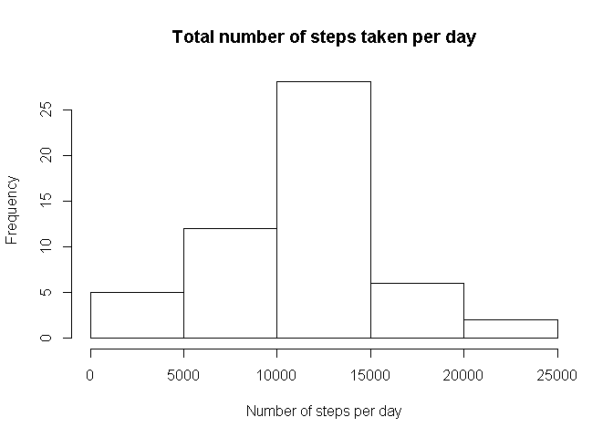
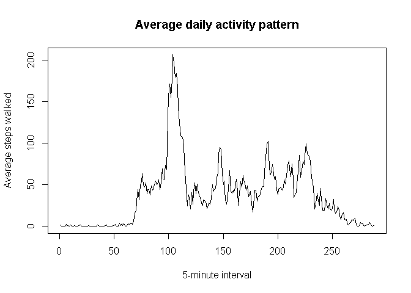
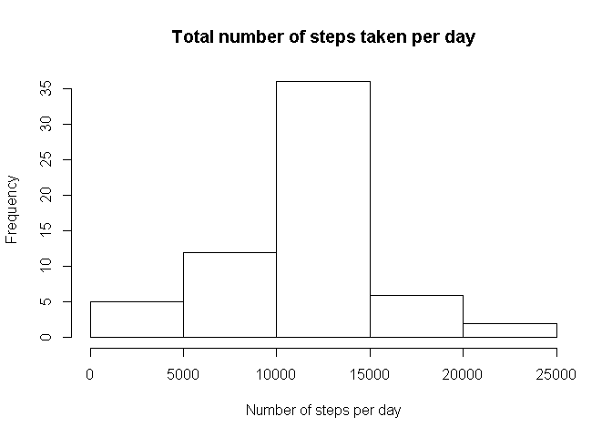
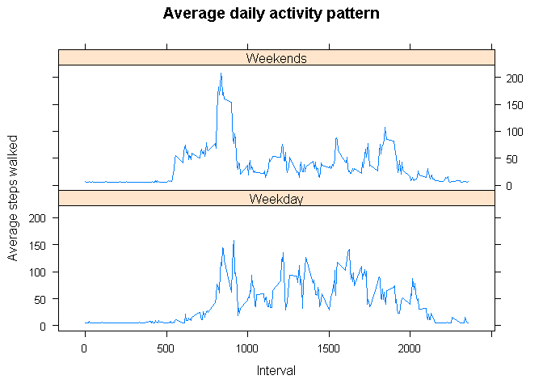

# Peer Assignment 1
mkansakar  
November 15, 2015  

*Loading and preprocessing the data*


```r
unzip("activity.zip")
dt <- read.csv("activity.csv",stringsAsFactors = F, header = T)
dt$date <- as.Date(dt$date, "%Y-%m-%d")
summary(dt)
```

```
##      steps             date               interval     
##  Min.   :  0.00   Min.   :2012-10-01   Min.   :   0.0  
##  1st Qu.:  0.00   1st Qu.:2012-10-16   1st Qu.: 588.8  
##  Median :  0.00   Median :2012-10-31   Median :1177.5  
##  Mean   : 37.38   Mean   :2012-10-31   Mean   :1177.5  
##  3rd Qu.: 12.00   3rd Qu.:2012-11-15   3rd Qu.:1766.2  
##  Max.   :806.00   Max.   :2012-11-30   Max.   :2355.0  
##  NA's   :2304
```

*Mean total number of steps taken per day*

- Since the question does not required to omit the NA, I am including all data. 
- Use tapply to sum up column-wise 


```r
StepsPerDay <- aggregate(steps ~ date, data = dt , sum)
hist(StepsPerDay$steps, xlab = "Number of steps per day", main = "Total number of steps taken per day")
```

 

*The mean and median of the total number of steps taken per day*

- Remove NA in order to calculate the mean and median
- Data set used here is taken from histogram code chunk


```r
mean(StepsPerDay$steps,na.rm=T)
```

```
## [1] 10766.19
```

```r
median(StepsPerDay$steps,na.rm=T)
```

```
## [1] 10765
```

*What is the average daily activity pattern*

- Plot time series 5-minute value in x-axis and avg steps in y-axis


```r
MeanStepsInterval <- aggregate(steps ~ interval, data = dt, mean, na.rm = T)
plot(MeanStepsInterval$steps, type = "l" , 
     main = "Average daily activity pattern" , 
     ylab = "Average steps walked", 
     xlab = "5-minute interval")
```

 

*5- minute Invterval that has the maximum average number of steps*

- The max average steps is at the n-th interval below


```r
MeanStepsInterval[which.max(MeanStepsInterval$steps),]
```

```
##     interval    steps
## 104      835 206.1698
```
*Imputing missing values*

- Number of missing data in steps column is:


```r
sum(is.na(dt$steps))
```

```
## [1] 2304
```

Here I am filling up the NA value with any mean value.


```r
meanTemp <- mean(StepsPerDay$steps,na.rm=T)
newdt <- dt
newdt[is.na(dt$steps),]$steps <- meanTemp/288
```

Plot the histogram again with new set of data


```r
NewStepsPerDay <- aggregate(steps ~ date, data = newdt , sum, na.rm = T)
hist(NewStepsPerDay$steps, xlab = "Number of steps per day", main = "Total number of steps taken per day")
```

 

Calculate the mean and median again.


```r
mean(NewStepsPerDay$steps,na.rm=T)
```

```
## [1] 10766.19
```

```r
median(NewStepsPerDay$steps,na.rm=T)
```

```
## [1] 10766.19
```

Add a new column Weekday to new data set newdt


```r
newdt$vWeekDay <- as.factor(ifelse(weekdays(newdt$date,abbreviate = F) %in% c("Sunday", "Saturday"),"Weekday","Weekends"))
newStepsOnWeekdayBasis <- aggregate(newdt$steps, by = list(newdt$interval,newdt$vWeekDay),mean)
newStepsOnWeekdayBasis <- aggregate(steps ~ interval + vWeekDay, data=newdt,mean)
names(newStepsOnWeekdayBasis) <- c("interval","weekdays","steps")
```

Plot a overlapping graph for weekend and weekday.


```r
library(lattice)
xyplot(steps ~ interval | weekdays, newStepsOnWeekdayBasis, 
       type = "l", 
       main = "Average daily activity pattern",
       layout = c(1,2), 
       xlab = "Interval", 
       ylab = "Average steps walked")
```

 
